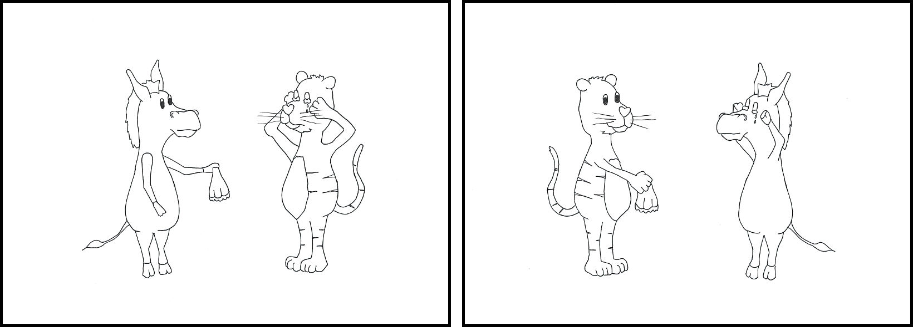

```{r setup, include=FALSE}
knitr::opts_chunk$set(echo = TRUE)
```

```{r loadlibs, warning=FALSE, message=FALSE}
library(tidyverse)
library(lme4)
library(car)
```

## Data
This dataset includes data of 50 language unimpaired control participants and 21 individuals with aphasia, all German native speakers. Participants carried out a self-paced listening experiment. While listening to the sentence, two pictures were displayed. After sentence end, the picture that matched the sentence best had to be selected. We manipulated the word order of the sentences: Either, the subject preceded the object (canonical) or the subject followed the object (non-canonical).

For example, the pictures displayed a donkey comforting a tiger and a tiger comforting a donkey (see below). For the canonical sentence \textit{Hier tröstet \textbf{der$_{nom}$} Tiger gerade \textbf{den$_{acc}$} Esel} "Here comforts \textbf{the$_{nom}$} tiger just \textbf{the$_{acc}$} donkey" the picture  displaying the tiger comforting the donkey had to be selected (right picture). For the non-canonical sentence \textit{Hier tröstet \textbf{den$_{acc}$} Tiger gerade \textbf{der$_{nom}$} Esel} "Here comforts \textbf{the$_{acc}$} tiger just \textbf{the$_{nom}$} donkey" the picture  displaying the donkey comforting the tiger had to be selected (left picture).

```{r pictureExp2, out.width='.99\\linewidth', echo=FALSE}

```

Description of the columns:

- subj: subject number 
- item: number of the item (number of items: n=20)
- condition: a (canonical) and b (non-canonical), we did not use a latin square design, i.e., all participants saw both conditions of all items
- region: region in the sentence (0, 1, 2, 3, question)
  - 0: sentence onset ("hier")
  - 1: verb ("tröstet")
  - 2: NP1 ("der Tiger")
  - 3: adverb ("gerade")
  - question: NP2 + picture selection ("den Esel" + picture selection)
- subj_status: healthy control (HC) or individual with aphasia (IWA)
- sentence: the respective auditory presented sentence
- word: the respective word of the sentence
- rt: listening time for the respective region
- acc: picture selection accuracy
- age, sex, years of education: demographic data of the participant
- aphasia_type: Aachen aphasia test syndrome, NA for control participants
- digit_symbol_substitution: WAIS subtest, number of correct items in two minutes
- digit span, block span: WMS-R subtests, forward and backward raw scores and longest span
- picture span: working memory test, forward and backward raw scores and longest span
- lexdec: lexical decision task, mean reaction times in the task

```{r loaddat}
dat<-read.table("SPL_decl.csv", sep=",", header=TRUE)

```

## Basic questions
1. Do we see faster listening times for canonical compared to non-canonical sentences in the critical region (region 2), i.e., do we see a canonicity effect? 
2. Does the canonicity effect interact with participant group?

```{r rq1and2, warning=FALSE, message=FALSE, fig.height=3}
datcrit<-subset(dat, region==2)

# quick plot of the canonicity effect
datcrit%>%
  group_by(subj_status, condition)%>%
  dplyr::summarize(Mrt=mean(rt), SDrt=sd(rt), SErt=SDrt/sqrt(n()))%>%
  mutate(condition=ifelse(condition=="a", "canonical", "non-canonical"),
         Group=ifelse(subj_status=="HC", "Control", "Aphasia"))%>%
  ggplot(aes(x=condition, y=Mrt, color=Group, group=Group))+
  geom_point()+geom_line()+
  geom_errorbar(aes(ymin=Mrt-2*SErt, ymax=Mrt+2*SErt), width=0.2)+
  theme_classic()+xlab("Word order")+ylab("Listening time (ms)")+
  scale_color_manual(values=c("black", "orange"))+
  ggtitle("Difference in listening times at the critical region")

# contrast coding
# I expect faster RTs for canonical trials
datcrit$cond<-ifelse(datcrit$condition=="a", -1, 1)
# I expect faster RTs for controls
datcrit$group<-ifelse(datcrit$subj_status=="HC", -1, 1)
datcrit$condxxgroup<-datcrit$cond*datcrit$group


# sanity checks 
# there should be 50 observations for controls and 21 for individuals with aphasia
xtabs(~cond+item+subj_status,datcrit)
xtabs(~group+item+condition, datcrit)
#the missing observations are correct (data collection error in subj 40)

m1<-lmer(log(rt)~cond+group+condxxgroup+(1+group+cond+condxxgroup||item)+
           (1+cond|subj), data = datcrit)
summary(m1)
#qqPlot(residuals(m1))


```

## My modeling issue
I am interested in the question whether the different cognitive factors (age, years of education, working memory scores, lexical decision times, score in the digit symbol substitution test) influence the canonicity effect in the critical region in the two participant groups. A minimal example for the factor age is given below. 

```{r rq3}
# Centering
datcrit$c_age<-scale(datcrit$age, center = TRUE, scale = FALSE)
datcrit$c_edu<-scale(datcrit$years_of_education, center = TRUE, scale = FALSE)
datcrit$c_ds<-scale(datcrit$digit_symbol_substituion, center = TRUE, scale = FALSE)
datcrit$c_lexdec<-scale(datcrit$lexdec, center = TRUE, scale = FALSE)
# for working memory, I will use the mean of the longest spans in the 
# digit, block and picture span tasks
datcrit$wm_composite_score<-rowMeans(
  datcrit[,which(grepl("longest_span", colnames(datcrit)))], na.rm = TRUE)
datcritc_wm<-scale(datcrit$wm_composite_score, center = TRUE, scale=FALSE)

# Age
m2<-lmer(log(rt)~(cond+group+condxxgroup)*c_age+(1+group+cond+condxxgroup||item)+
           (1+cond|subj), data = datcrit)
summary(m2)


```

